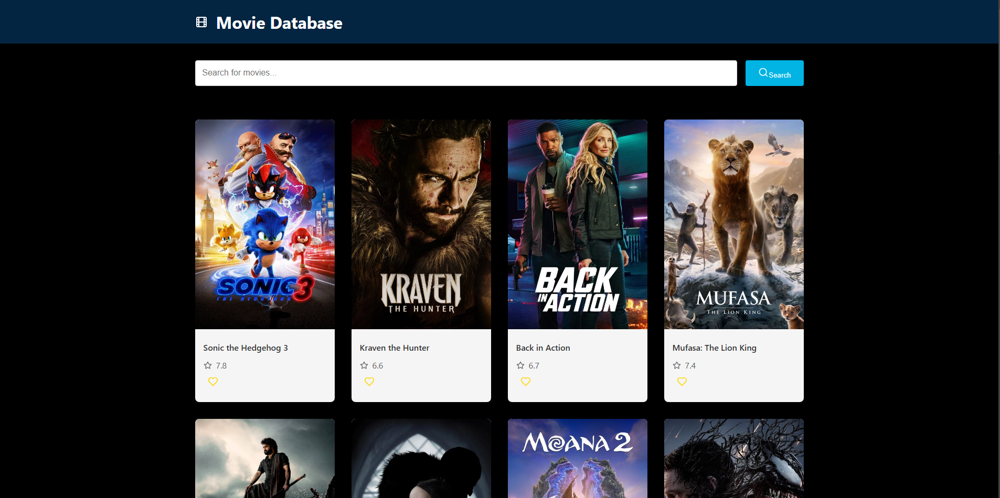

  ```markdown
# 🎥 Movie/TV Show Database

A Movie/TV Show Database application built with React.js that allows users to search, discover, and save their favorite movies and TV shows. This project fetches data from the [TMDB API](https://www.themoviedb.org/documentation/api) and provides an interactive, user-friendly interface to explore entertainment content.

---

## 🚀 Features

- **Search Functionality**: Quickly search for movies or TV shows by title.
- **Responsive Design**: Works seamlessly on desktops, tablets, and mobile devices.

---

## 🛠️ Technologies Used

- **Frontend**: React.js,CSS
- **API**: TMDB API
- **Routing**: React Router
- **Icons**: [Heroicons](https://heroicons.com/) or [Lucide React](https://lucide.dev/)

---

## 🌟 Getting Started

### Prerequisites
- Node.js and npm installed on your system.
- An API key from [TMDB](https://www.themoviedb.org/documentation/api).

### Installation

1. Clone the repository:
   ```bash
   git clone https://github.com/Rakshit-027/Movies-database-system.git
   cd movie-tv-show-database
   ```

2. Install dependencies:
   ```bash
   npm install
   ```

3. Create a `.env` file in the root directory and add your TMDB API key:
   ```env
   REACT_APP_TMDB_API_KEY=your_api_key_here
   ```

4. Start the development server:
   ```bash
   npm start
   ```

5. Open the app in your browser:
   ```
   http://localhost:5073
   ```

---

## 🖼️ Screenshots (Optional)


---

## 📂 Project Structure

```
project/
└── src/
    ├── App.tsx
    ├── components/
    │   ├── MovieCard.tsx
    │   └── SearchBar.tsx
    ├── context/
    │   └── WatchlistContext.tsx
    ├── index.css
    ├── main.tsx
    ├── services/
    │   └── tmdb.ts
    ├── styles/
    │   └── global.css
    └── vite-env.d.ts
```

---

## 🔧 Features to Add Later (Optional)
- User authentication to save personalized watchlists.
- Reviews and rating submission.
- Advanced filters like "Now Playing" and "Coming Soon."
- Light/Dark mode toggle.

---

## 🤝 Contribution Guidelines
1. Fork the repository.
2. Create a new branch:
   ```bash
   git checkout -b feature-name
   ```
3. Commit your changes and push to your fork:
   ```bash
   git commit -m "Add feature name"
   git push origin feature-name
   ```
4. Submit a pull request.

---

## 📜 License

This project is licensed under the MIT License.

---

## 🌟 Acknowledgments

- [TMDB API](https://www.themoviedb.org/documentation/api)
- [React.js Documentation](https://reactjs.org/)

---

### 👨‍💻 Author

Developed by [Rakshit Waghmare](https://rakshitw.netlify.app/)

Feel free to customize and improve!
```  

Let me know if you'd like to include more sections or make adjustments!